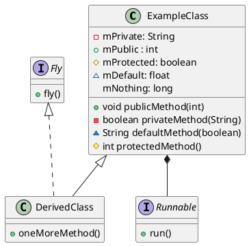

## Test 
```plantumlcode
#@startuml

class ExampleClass {
    -mPrivate: String
    +mPublic : int
    #mProtected: boolean
    ~mDefault: float
    mNothing: long
    +void publicMethod(int)
    -boolean privateMethod(String)
    ~String defaultMethod(boolean)
    #int protectedMethod()
}

class DerivedClass {
    +oneMoreMethod()
}

interface Fly {
    +fly()
}

interface Runnable {
    +run()
}

ExampleClass <|-- DerivedClass
Fly <|.. DerivedClass
ExampleClass *-- Runnable

#@enduml
```

Output

